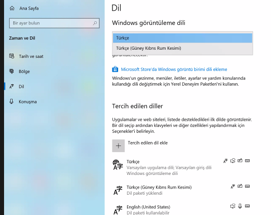

# Assignment 04
Make sure your Keyboard language settings are 'English'

Go to the settings and change it from whatever language it might currently be in to English.

English is the language this course is taught in.

It will be important for you to get a mouse as well.