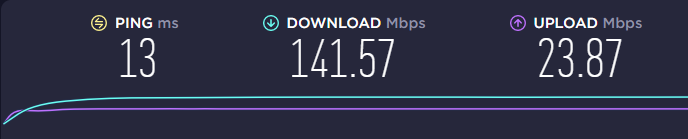

# What to Bring to Class
- another monitor ( you need to watch the instructor on one screen while you work on another )
- hdmi
- hdmi adapter (for Apple products)
- ethernet cable to directly plug into your router/modem
- laptop
- mouse

# Check Wi-Fi Speed
- Go to google.com
- Search 'ookla speed test'
- click the 'Go' button - you will see something similar to below

- send the download speed and upload speed to 'HR' in slack

# Google these Topics and Watch how to perform these actions on your own laptop
- how to screenshare in Zoom
- how to connect a dual monitor
- how to take a screenshot
- how to join a slack call
- how to think about coding

